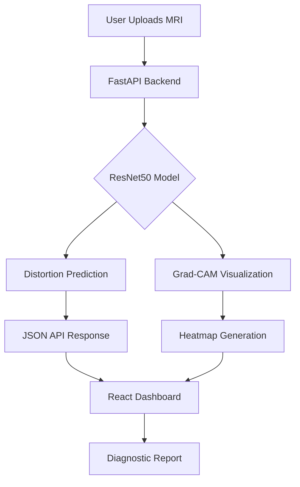

# NeuroScan Engine: Advanced MRI Distortion Detection Framework

<div align="center">
  
  
  
</div>

---

## 🔬 Project Overview
**NeuroScan Engine** is a high-performance diagnostic suite designed to detect and localize distortions in MRI scans. This project bridges the gap between deep learning complexity and clinical utility by providing interpretable visual feedback through **Grad-CAM** and **Grad-CAM++**.

### 🎯 Objective
To provide a robust, automated framework for MRI quality assurance, reducing manual inspection time and improving diagnostic reliability in clinical environments.

---

## 🚀 Portfolio Highlights
- **Deep Learning Mastery**: Implemented a fine-tuned ResNet50 architecture for high-accuracy medical image classification.
- **Interpretability (XAI)**: Integrated advanced heatmapping techniques to "see through the eyes of the AI," ensuring clinical trust.
- **Full-Stack Integration**: Developed a seamless pipeline from a Python/FastAPI backend to a modern, glassmorphism-themed React dashboard.
- **Data Pipeline**: Designed custom preprocessing routines for medical-grade image data (DICOM/PNG handling).

---

## 🛠️ Technical Architecture



### Backend (The Brain)
- **Framework**: FastAPI (Asynchronous processing)
- **Logic**: ResNet50 backbone with custom output layers.
- **Optimization**: Efficient tensor manipulation using NumPy and TensorFlow.

### Frontend (The Workstation)
- **Framework**: React 18 + Vite
- **UI Design**: "Aero-Glass" aesthetic with real-time scanning animations.
- **State Management**: React Context API for global diagnostic state.

---

## 📊 Technical Challenges & Solutions
- **Challenge**: Model "Black Box" nature in medical fields.
- **Solution**: Implemented **Grad-CAM++** to provide higher-fidelity localization of distorted regions compared to standard Grad-CAM.
- **Challenge**: Performance on high-resolution MRI slices.
- **Solution**: Developed a chunk-based processing and normalization pipeline to maintain speed without losing diagnostic detail.

---

## 🖼️ User Interface
*(Recommendation: Add screenshots of your Dashboard and Grad-CAM results here)*

| Landing Page | Diagnostic Dashboard |
| :---: | :---: |
| [Placeholder for Image] | [Placeholder for Image] |

---

## 📈 Future Roadmap
- [ ] Support for 3D MRI Volumetric Analysis.
- [ ] Integration with DICOM servers (PACS).
- [ ] Multi-class classification (Motion Blur, Metal Artifacts, etc.).
- [ ] Mobile-responsive diagnostic viewer.

---

## 🤝 Connect with Me
- **GitHub**: [yashaswini-1128](https://github.com/yashaswini-1128)
- **LinkedIn**: [Your Profile Name]
- **Email**: [your.email@example.com]

---

### 📝 Citation
If you use this work in your research, please cite:
```text
Yashaswini. (2024). NeuroScan Engine: A Robust and Explainable CNN Framework for Automated MRI Distortion Detection.
```

---
